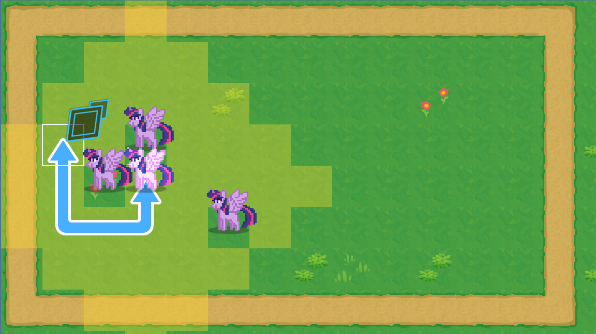

# Tactical RPG movement

The [guide](https://www.gdquest.com/tutorial/godot/2d/tactical-rpg-movement/lessons/00.handling-grid-interactions/) I used to.

Features:

- Grid-based movement.

- Cursor to navigate the map and select a unit.

- Displays the unit's walkable area.

- Displays the unit's path preview.

- The user can validate or cancel the movement.

